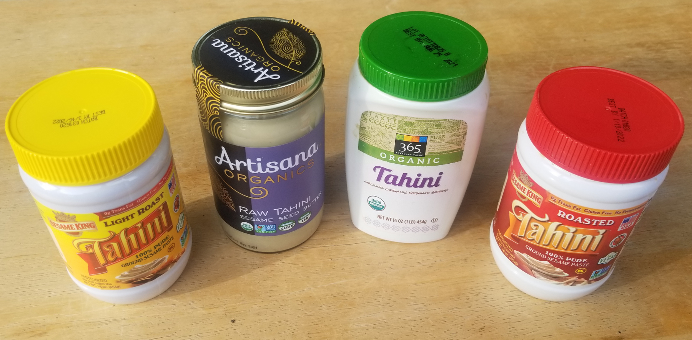



## Background

Tahini is amazing. A condiment made from toasted ground hulled sesame, tahini can be added to a variety of dishes and drinks to improve taste, texture and [nutritional value](https://fdc.nal.usda.gov/fdc-app.html#/food-details/168604/nutrients).

Tahini is best when purchased as 100% sesame paste.


To prepare it, water, lemon and favorite spices are slowly added and stirred. In this process, something very odd happens. The tahini at room temperature starts as a viscous fluid. As water is added to the mixture, the tahini goes through a *phase shift* and becomes granular solid. As more water is added, the tahini returns to a fluid and delicious state.

[Video demonstration (2X speed)](assets/real_tahini_2x.mp4)

Notice that while sharing certain similarities, Tahini is *not* a "classical" non-Newtonian fluid, which exhibits phase shifts as response to stress. Tahini's phase is defined the amount of water in the system, and the solid phase is dependent on "just the right amount" - too little or too much water, and tahini is still liquid (viscous, but liquid). Not exhibited in the video, having the right amount for a long time creates such a solid piece of Tahini that it might break a blender. Be careful.

This process is sometimes described as "seizing" and is not unique to Tahini. Peanut butter, as well as non edible materials such as plaster, are known to seize up water and solidify before going to liquid state. This happens as small amounts water act as a cross-linker between molecules. We assume a similar process happens for tahini, while the liquid starting point is due to the high oil concentration.

## Simulation


Tahini phase shifts was simulated using [PySPH](https://pysph.readthedocs.io/en/latest/), a powerful framework for fluid simulation. The system contains two types of particles: tahini and solid (bowl, spoon). The tahini particles contain a property which corresponds to the amount of H2O aorund that particle. In addition to to fluid flow equations (See Implementation) - a new equation was added to the system, each two particles interact by Van der Waalce force (Lennard Jones potential) dependent on a Gaussian of the sum of the H2O for both particles.

## Implementation (the beginning)

The code is based on [hydrostatic_tank](https://github.com/pypr/pysph/blob/master/pysph/examples/hydrostatic_tank.py) example from PySPH, where fluid particles are floating in a tank. Each PySPH program basically contains three parts: particles, equations and a solver. First, I will describe the 2D version of fluid siumlation in a bowl mixed by a spoon (no phase shifts, yet)

### Create the Particles

We create a bowl, tahini and a mixing spoon. We create a uniform mesh grid:

```python
# dimensions
Lx = 2.0
Ly = 1.0
Cx = 1.0
Cy = 1.0
bowlR = 1.0
tahiniH = 0.5

# the higher this number, the more refined the simulation is (and the longer it takes...)
nx = 100
dx = Lx / nx
ghost_extent = 5.5 * dx

_x = np.arange(-ghost_extent, Lx + ghost_extent, dx)
_y = np.arange(-ghost_extent, Ly, dx)
x, y = np.meshgrid(_x, _y)
x = x.ravel()
y = y.ravel()
```

And create objects based on particle coordinates.

Bowl (hollow half sphere)
```python
p_bowl = []
for i in range(x.size):
    r = (x[i] - Cx)**2 + (y[i] - Cy)**2
    if r > bowlR**2 and r < (bowlR + ghost_extent)**2:
        p_bowl.append(i)

x_bowl = x[p_bowl]
y_bowl = y[p_bowl]
```

Spoon (funky shape)
```python
p_spoon = []
for i in range(x.size):
    if y[i] > 0.25 and ((x[i] > 0.6 and x[i] < 0.8 and y[i] < tahiniH) or (x[i] > 0.66 and x[i] < 0.74)):
        p_spoon.append(i)

x_spoon = x[p_spoon]
y_spoon = y[p_spoon]
```

Tahini (sphere minus spoon)
```python
p = []
for i in range(x.size):
    if i in p_spoon:
        continue
    r = (x[i] - Cx)**2 + (y[i] - Cy)**2
    if r < bowlR**2 and y[i] < tahiniH:
        p.append(i)

x_tahini = x[p]
y_tahini = y[p]
```

Next, we define properties for each particle:

```python
tahini.rho[:] = rho0
bowl.rho[:] = rho0
spoon.rho[:] = rho0

# mass is set to get the reference density of rho0
volume = dx * dx

# volume is set as dx^2
tahini.V[:] = 1. / volume
bowl.V[:] = 1. / volume
spoon.V[:] = 1. / volume

tahini.m[:] = volume * rho0
bowl.m[:] = volume * rho0
spoon.m[:] = volume * rho0
```

### Define the Equations

The hydrostatic_tank contains three ways to check for the boundary between the solid and liquid particles:

 - [Adami et al. "A generalized wall boundary condition for smoothed
   particle hydrodynamics", 2012, JCP, 231, pp 7057--7075](https://www.sciencedirect.com/science/article/pii/S002199911200229X?casa_token=aQ5VRuReYuEAAAAA:5HpBoFwsU_cXWDH4BeM7h2iShXCEA-rcXqHn4GO5diZAe3NfHG3Qh76-iSlcG-C2t4YYmqSiEA) (REF1)

 - [Monaghan and Kajtar, "SPH particle boundary forces for arbitrary
   boundaries", 2009, 180, pp 1811--1820](https://ui.adsabs.harvard.edu/abs/2009CoPhC.180.1811M/abstract) (REF2)

 - [Gesteria et al. "State-of-the-art of classical SPH for free-surface
   flows", 2010, JHR, pp 6--27](https://ephyslab.uvigo.es/publica/documents/file_6Gomez-Gesteira_et_al_2010_JHR_SI.pdf) (REF3)

REF2 requires special spacing between fluid and solid particles, and REF1 proved to be 75% slower in my experiments, so I'm using the third formulation:

```python
equations3 = [
    # For the multi-phase formulation, we require an estimate of the
    # particle volume. This can be either defined from the particle
    # number density or simply as the ratio of mass to density.
    Group(equations=[
        VolumeFromMassDensity(dest='tahini', sources=None)
    ], ),

    # Equation of state is typically the Tait EOS with a suitable
    # exponent gamma. The solid phase is treated just as a fluid and
    # the pressure and density operations is updated for this as well.
    Group(equations=[
        TaitEOS(dest='tahini',sources=None,rho0=rho0,c0=c0,gamma=gamma),
        TaitEOS(dest='bowl',sources=None,rho0=rho0,c0=c0,gamma=gamma),
        TaitEOS(dest='spoon',sources=None,rho0=rho0,c0=c0,gamma=gamma),
    ], ),

    # Main acceleration block. The boundary conditions are imposed by
    # peforming the continuity equation and gradient of pressure
    # calculation on the bowl phase, taking contributions from the
    # tahini phase
    Group(equations=[
        # Continuity equation
        ContinuityEquation(dest='tahini', sources=['tahini', 'bowl', 'spoon']),
        ContinuityEquation(dest='bowl', sources=['tahini']),
        ContinuityEquation(dest='spoon', sources=['tahini']),

        # Pressure gradient with acceleration damping.
        MomentumEquationPressureGradient(
            dest='tahini', sources=['tahini', 'bowl', 'spoon'], pb=0.0, gy=gy,
            tdamp=tdamp),

        # artificial viscosity for stability
        MomentumEquationArtificialViscosity(
            dest='tahini', sources=['tahini', 'bowl', 'spoon'], alpha=1, c0=c0),

        # Position step with XSPH
        XSPHCorrection(dest='tahini', sources=['tahini'], eps=0.5)

    ]),
]
 ```

Each of these equations define a set of confitions that will be integrated over the 'dest' particles. In case of particle-particles interactions, the sources parameter defines each particle type. A few equations behind the scenes:


- ContinuityEquation - conservation of mass

$$
\frac{d\rho_a}{dt} = \rho_a \sum_b \frac{m_b}{\rho_b} \boldsymbol{v}_{ab} \cdot \nabla_a W_{ab}
$$

- MomentumEquationPressureGradient - pressure

$$
\frac{d \boldsymbol{v}_a}{dt} = \frac{1}{m_a}\sum_b (V_a^2 +V_b^2)\left[-\bar{p}_{ab}\nabla_a W_{ab} \right]
$$

- MomentumEquationArtificialViscosity - viscosity

$$
\frac{d \boldsymbol{v}_a}{dt} = -\sum_b m_b \alpha h_{ab}
      c_{ab} \frac{\boldsymbol{v}_{ab}\cdot
      \boldsymbol{r}_{ab}}{\rho_{ab}\left(|r_{ab}|^2 + \epsilon
      \right)}\nabla_a W_{ab}
$$

To move the spoon around, I defined a simple harmonic undamped force equation and applied it on the spoon particles:

```python
class HarmonicOscilllator(Equation):
    def __init__(self, dest, sources, A=4.0, omega=0.5):
        self.A = A
        self.omega = omega
        super(HarmonicOscilllator, self).__init__(dest, sources)

    def initialize(self, d_idx, d_au, d_av, d_aw, t):
        d_au[d_idx] = self.A * cos(self.omega * 2 * M_PI * t)
```

Add it to the equations list:
```python
...
# Spoon Equations
Group(equations=[
    HarmonicOscilllator(dest='spoon', sources=None, A=0.5, omega=0.2),

    # Translate acceleration to positions
    XSPHCorrection(dest='spoon', sources=['spoon'], eps=0.0)
], real=False),
...
```

### Solve it

Last, we define an kernel and integrator:

```
# Create the kernel
#kernel = Gaussian(dim=2)
kernel = CubicSpline(dim=2)
#kernel = QuinticSpline(dim=2)

integrator = PECIntegrator(tahini=WCSPHStep(), bowl=WCSPHStep(), spoon=WCSPHStep())

# Create a solver.
solver = Solver(kernel=kernel, dim=2, integrator=integrator,
                tf=tf, dt=dt,
                adaptive_timestep=False
                )
return solver
```

### And the results


The colors represents the velocity magnitude. Using 1500~ tahini particles, approximately 3 minutes to run on my laptop using multicore (OpenMPI)

## From fluid to tahini and back again

Now it's time to make things more interesting, I decided to create the following model - each tahini particle hold a property which symbolizes the amount of H2O in its vicinity. Now we are going to make every two tahini particles interact using Van der Waals force, which we define by the Lennard Jones potential:

$$
U_{ij} = 4 \epsilon \Big((\frac{sigma}{r_{ij}})^12 - (\frac{sigma}{r_{ij}})^6)
$$


Where $\espilon$ is a magic number that we have to choose for our settings. $\sigma$ is the max distance at which two particles have an effect, and $r_{ij}$ is the distance between te particles

The force acting on two particles would be

$$
F_{ij} = \frac{dU}{dr}\frac{r_i - r_j}{|r_i - r_j|} = 24 \epsilon \Big(2 * (\frac{sigma^12}{r_{ij}^13}) - (\frac{sigma^6}{r_{ij}^7}))\frac{r_i - r_j}{|r_i - r_j|}
$$

And now comes the trick. We apply this force with a certain *probability*, a Gaussian which depends on the amount of H2O both particles have. So, if there is no water OR too much water, the particles will not be exhibit Van der Waals forces. If there is just the right amount (and ths we introduce another magic number, which can be experimentally found...)

$$
p_{ij} = exp(\frac{-({H2O}_i + {H2O}_j - \mu)^2}{\sigma})
$$

We set $\mu = 1$ and $\sigma=1/12$, so low amount of water will exhibit nearly zero interaction force

The code for the equation looks like:

```python
class TahiniEquation(Equation):
    def __init__(self, dest, sources, sigma):
        self.eps = 0.5      # magic number
        self.sigma = sigma  # the distance in which particles have no effect
        self.var = 12       # the inverse variance of the gaussian. we want this so e^(-1 * var) ~ 0
        super(TahiniEquation, self).__init__(dest, sources)

    def initialize(self, d_idx, d_au, d_av, d_aw):
        d_au[d_idx] = 0.0
        d_av[d_idx] = 0.0
        d_aw[d_idx] = 0.0

    def loop(self, d_idx, d_m, d_au, d_av, d_aw, s_idx, s_m, d_h2o_amount, s_h2o_amount, RIJ, XIJ):
        if RIJ > 1e-9:
            # Gaussian distrbution for tahini-water-tahini interaction
            p = M_E ** (- (d_h2o_amount[d_idx] + s_h2o_amount[s_idx] - 1) ** 2 * self.var)

            # Forced derived from Lennard-Jones potential
            F_LJ = 24 * self.eps * (- 2 * (self.sigma ** 12 / RIJ ** 13) + (self.sigma ** 6 / RIJ ** 7))

            # normal vector passing from particle i to j
            nij_x = -XIJ[0] / RIJ
            nij_y = -XIJ[1] / RIJ
            nij_z = -XIJ[2] / RIJ
        else:
            p = 0.0
            F_LJ = 0.0

            nij_x = 0.0
            nij_y = 0.0
            nij_z = 0.0

        d_au[d_idx] += p * F_LJ * nij_x
        d_av[d_idx] += p * F_LJ * nij_y
        d_aw[d_idx] += p * F_LJ * nij_z
```

And we add it to our equation list:

```python
equations=[ ... TahiniEquation(dest='tahini', sources=['tahini'], sigma=dx / 1.122), ... ]
```

If we now set every particle water content to 0.5 (the ideal), we now get:


Pretty solid!
